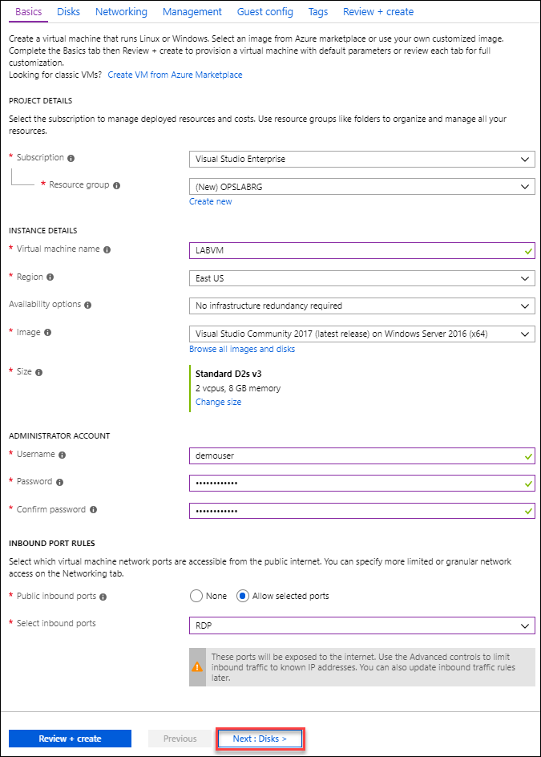
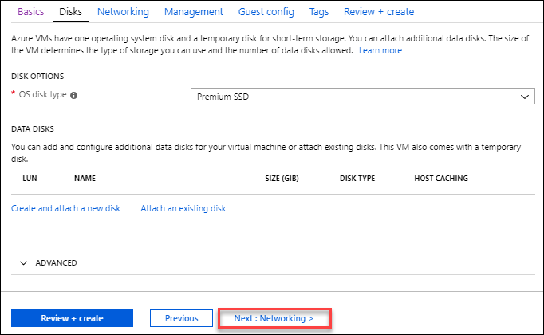
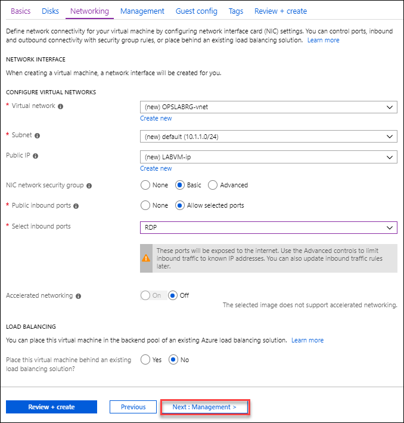
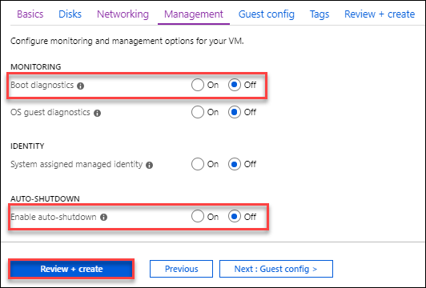
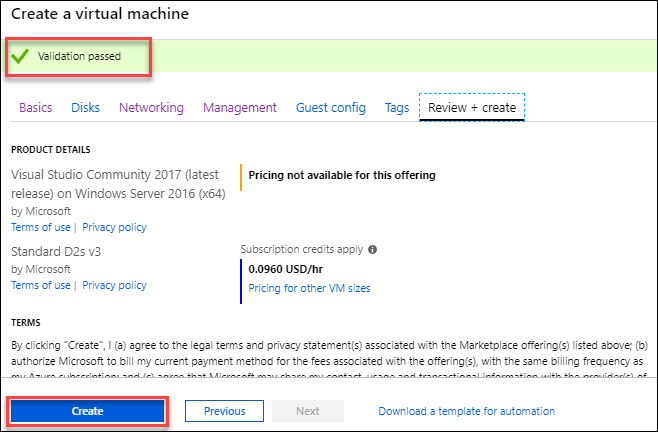
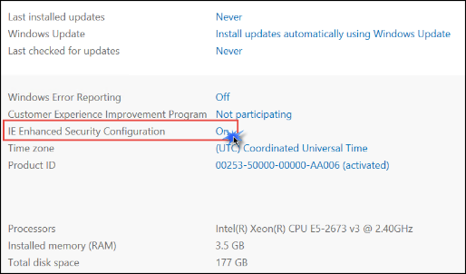

Linux lift and shift

Before the hands-on lab setup guide

December 2018

Information in this document, including URL and other Internet Web site references, is subject to change without notice. Unless otherwise noted, the example companies, organizations, products, domain names, e-mail addresses, logos, people, places, and events depicted herein are fictitious, and no association with any real company, organization, product, domain name, e-mail address, logo, person, place or event is intended or should be inferred. Complying with all applicable copyright laws is the responsibility of the user. Without limiting the rights under copyright, no part of this document may be reproduced, stored in or introduced into a retrieval system, or transmitted in any form or by any means (electronic, mechanical, photocopying, recording, or otherwise), or for any purpose, without the express written permission of Microsoft Corporation.

Microsoft may have patents, patent applications, trademarks, copyrights, or other intellectual property rights covering subject matter in this document. Except as expressly provided in any written license agreement from Microsoft, the furnishing of this document does not give you any license to these patents, trademarks, copyrights, or other intellectual property.

The names of manufacturers, products, or URLs are provided for informational purposes only and Microsoft makes no representations and warranties, either expressed, implied, or statutory, regarding these manufacturers or the use of the products with any Microsoft technologies. The inclusion of a manufacturer or product does not imply endorsement of Microsoft of the manufacturer or product. Links may be provided to third party sites. Such sites are not under the control of Microsoft and Microsoft is not responsible for the contents of any linked site or any link contained in a linked site, or any changes or updates to such sites. Microsoft is not responsible for webcasting or any other form of transmission received from any linked site. Microsoft is providing these links to you only as a convenience, and the inclusion of any link does not imply endorsement of Microsoft of the site or the products contained therein.

© 2018 Microsoft Corporation. All rights reserved.

Microsoft and the trademarks listed at <https://www.microsoft.com/en-us/legal/intellectualproperty/Trademarks/Usage/General.aspx> are trademarks of the Microsoft group of companies. All other trademarks are property of their respective owners.

**Contents**

<!-- TOC -->

- [Linux lift and shift before the hands-on lab setup guide](#linux-lift-and-shift-before-the-hands-on-lab-setup-guide)
  - [Requirements](#requirements)
  - [Before the hands-on lab](#before-the-hands-on-lab)
    - [Task 1: Create a virtual machine to execute the lab](#task-1-create-a-virtual-machine-to-execute-the-lab)
    - [Task 2: Install the MySQL Workbench](#task-2-install-the-mysql-workbench)
    - [Task 3: Download hands-on lab step-by-step attendee files](#task-3-download-hands-on-lab-step-by-step-attendee-files)

<!-- /TOC -->

# Linux lift and shift before the hands-on lab setup guide

## Requirements

- You must have a working Azure subscription to carry out this hands-on lab step-by-step.

## Before the hands-on lab

Duration: 30 Minutes

### Task 1: Create a virtual machine to execute the lab

1.  Launch a browser and navigate to <https://portal.azure.com>. Once prompted, login with your Microsoft Azure credentials. If prompted, choose whether your account is an organization account or just a Microsoft Account.

2.  Click on **+Create a resource**, and in the search box type in **Visual Studio Community 2017** and press enter. Click the Visual Studio Community 2017 image running on Windows Server 2016 and with the latest update.

    

3.  In the Marketplace solution blade, at the bottom of the page keep the deployment model set to **Resource Manager**, and click **Create**.

    

4.  Set the following configuration on the Basics tab and click **Next: Disks >**:

    -   Subscription: **If you have multiple subscriptions choose the subscription to execute your labs in.**

    -   Resource Group: **OPSLABRG**

    -   Virtual machine name: **LABVM**

    -   Region: **Choose the closest Azure region to you**

    -   Availability options: **No infrastructure redundancy required**

    -   Image: **Visual Studio Community 2017 (latest release) on Windows Server 2016 (x64)**

    -   Size: **Standard D2S v3**

    -   Username: **demouser**

    -   Password: **demo\@pass123**

    -   Publich inbound ports: **Allow selected ports**

    -   Select inbound ports: **RDP**

    -   Already have a Windows License?: **No**

    

5.  Verify the following configurations on the Disks tab and then click **Next: Netoworking >**.

    -   OS disk type: **Premium SSD**

    

6.  Accept the defaults on the Networking tab and then click **Next: Management**.

    

7.  On the Management tab, turn off **Boot diagnostics** and **Enable auto-shutdown** and then click **Review + Create**.

    

8.  After the validation has passed, click the **Create** button to deploy the virtual machine. The deployment should begin provisioning. It may take 10+ minutes for the virtual machine to complete provisioning.

    

    >**Note**: Please wait for the LABVM to be provisioned prior to moving to the next step.

9.  After the deployment completes, navigate to your **LABVM** and click **Connect** to establish a new Remote Desktop Session.

    

10. Depending on your remote desktop protocol client and browser configuration you will either be prompted to open an RDP file, or you will need to download it and then open it separately to connect.

11. Log in with the credentials specified during creation:

    -   User: **demouser**

    -   Password: **demo\@pass123**

12. You will be presented with a Remote Desktop Connection warning because of a certificate trust issue. Click **Yes** to continue with the connection.

    

13. When logging on for the first time you will see a prompt on the right asking about network discovery. Click **No**.

    

14. Notice that Server Manager opens by default. On the left, click **Local Server**.

    

15. On the right side of the pane, click **On** by **IE Enhanced Security Configuration**.

    

16. Change to **Off** for Administrators and click **OK**.

    

### Task 2: Install the MySQL Workbench

1.  While logged into **LABVM** via remote desktop, open Internet Explorer and navigate to <https://dev.mysql.com/get/Downloads/MySQLGUITools/mysql-workbench-community-6.3.10-winx64.msi> this will download an executable. After the download is finished, click **Run** to execute it.

2.  Follow the directions of the installer to complete the installation of MySQL Workbench.

3.  After the installation is complete, **reboot** the machine.

### Task 3: Download hands-on lab step-by-step attendee files

1.  After the reboot has completed, download the zipped hands-on lab step-by-step attendee files by clicking on this link:  
https://cloudworkshop.blob.core.windows.net/linux-lift-shift/MCW-linux-lift-shift.zip.

2.  Extract the downloaded files into the directory **C:\\HOL**.

You should follow all steps provided *before* performing the Hands-on lab.
