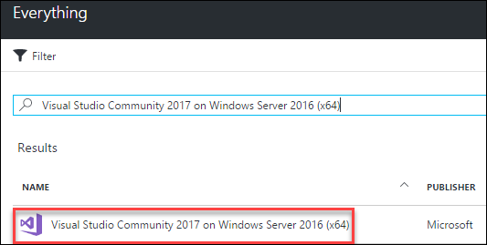
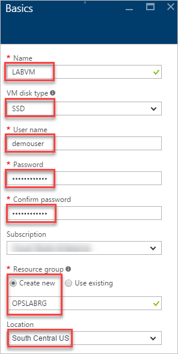
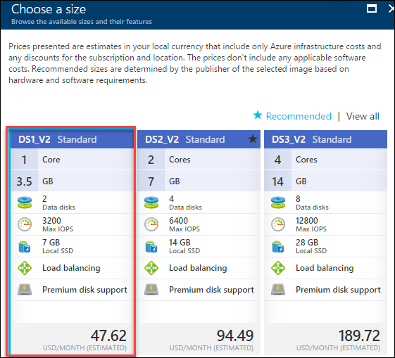
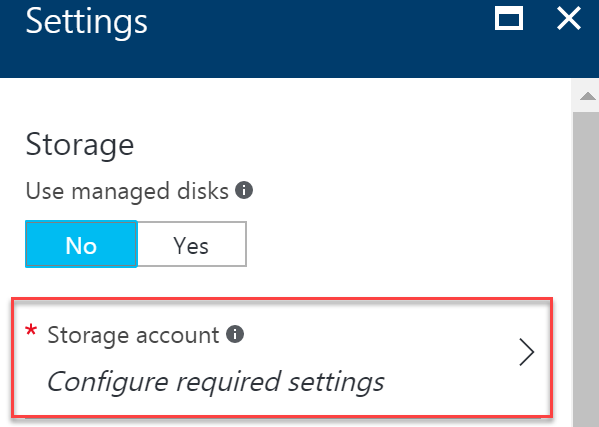
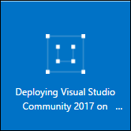
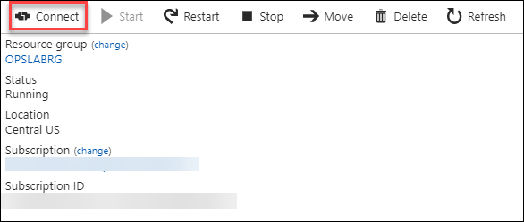

# Linux Lift and Shift setup

## Requirements

- You must have a working Azure subscription to carry out this hands-on lab step-by-step.

## Before the hands-on lab

Duration: 30 Minutes

### Task 1: Create a virtual machine to execute the lab

1.  Launch a browser and navigate to <https://portal.azure.com>. Once prompted, login with your Microsoft Azure credentials. If prompted, choose whether your account is an organization account or just a Microsoft Account.

2.  Click on **+NEW**, and in the search box type in **Visual Studio Community 2017 on Windows Server 2016 (x64)** and press enter. Click the Visual Studio Community 2017 image running on Windows Server 2016 and with the latest update.

3.  In the returned search results, click the image name.

    

4.  In the Marketplace solution blade, at the bottom of the page keep the deployment model set to **Resource Manager**, and click **Create**.

    

5.  Set the following configuration on the Basics tab and click **OK**.

    -   Name: **LABVM**

    -   VM disk type: **SSD**

    -   User name: **demouser**

    -   Password: **demo\@pass123**

    -   Subscription: **If you have multiple subscriptions choose the subscription to execute your labs in.**

    -   Resource Group: **OPSLABRG**

    -   Location: **Choose the closest Azure region to you.**

    

6.  Choose the **DS1\_V2 Standard** or **DS2\_V2** instance size on the Size blade.

**Note**: You may have to click the **View All** link to see the instance sizes.

**Note**: If the Azure Subscription you are using is [NOT]{.underline} a trial Azure subscription you may want to chose the DS2\_V2 to have more power in this LABMV. If you are using a trial subscription or one that you know has a restriction on the number of cores stick with the DS1\_V2.

7.  Click **Configure required settings** to specify a storage account for your virtual machine if a storage account name is not automatically selected for you.

    

8.  Click **Create New**

    

9.  Specify a unique name for the storage account (all lower letters and alphanumeric characters) and ensure the green checkmark shows the name is valid.

    

10. Click **OK** to continue.

    

11. Click **Configure required settings** for the Diagnostics storage account if a storage account name is not automatically selected for you. Repeat the previous steps to select a unique storage account name. This storage account will hold diagnostic logs about your virtual machine that you can use for troubleshooting purposes.

    

12. Accept the remaining default values on the Settings blade and click **OK**. On the Summary page click **OK**. The deployment should begin provisioning. It may take 10+ minutes for the virtual machine to complete provisioning.

    

**Note**: Please wait for the LABVM to be provisioned prior to moving to the next step.

13. Move back to the Portal page on your local machine and wait for **LABVM** to show the Status of **Running**. Click **Connect** to establish a new Remote Desktop Session.

    

14. Depending on your remote desktop protocol client and browser configuration you will either be prompted to open an RDP file, or you will need to download it and then open it separately to connect.

15. Log in with the credentials specified during creation:

    -   User: **demouser**

    -   Password: **demo\@pass123**

16. You will be presented with a Remote Desktop Connection warning because of a certificate trust issue. Click **Yes** to continue with the connection.

    

17. When logging on for the first time you will see a prompt on the right asking about network discovery. Click **No**.

    

18. Notice that Server Manager opens by default. On the left, click **Local Server**.

    

19. On the right side of the pane, click **On** by **IE Enhanced Security Configuration**.

    

20. Change to **Off** for Administrators and click **OK**.

    

### Task 2: Install the MySQL Workbench

1.  While logged into **LABVM** via remote desktop, open Internet Explorer and navigate to <https://dev.mysql.com/get/Downloads/MySQLGUITools/mysql-workbench-community-6.3.10-winx64.msi> this will download an executable. After the download is finished, click **Run** to execute it.

2.  Follow the directions of the installer to complete the installation of MySQL Workbench.

3.  After the installation is complete, **reboot** the machine.

### Task 3: Download hands-on lab step-by-step attendee files

1.  After the reboot has completed, download the zipped hands-on lab step-by-step attendee files by clicking on this link:

https://cloudworkshop.blob.core.windows.net/linux-lift-shift/MCW-linux-lift-shift.zip

2.  Extract the downloaded files into the directory **C:\\HOL**